<h1 align="center">Deeztracker</h1>

<p align="center">
  
</p>

<p align="center">
  <strong>A modern Android music application for downloading and playing music offline</strong>
</p>

<p align="center">
  
  
  
</p>

---

## 📱 Overview

Deeztracker Mobile is a feature-rich Android application that allows users to download music from Deezer for offline playback. Built with modern Android development practices using Kotlin and Jetpack Compose, it offers a sleek, intuitive interface with full offline music library management.

---

## ✨ Features

### 🔍 Search & Discovery
- **Track Search**: Find and download individual songs
- **Album Search**: Browse and download complete albums
- **Artist Search**: Explore artist discographies with top tracks and albums
- **Playlist Search**: Import and download entire playlists

<p align="center">
  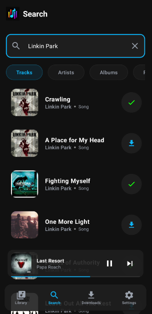
  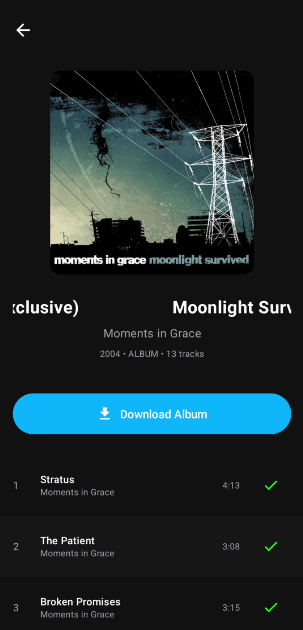
  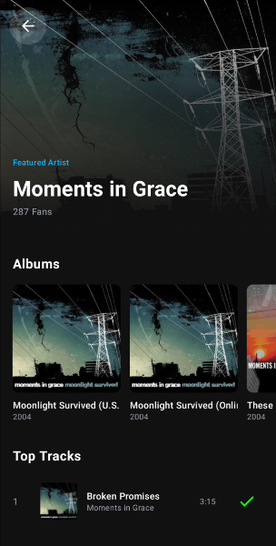
  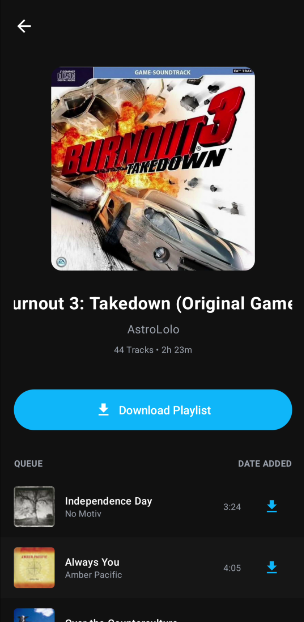
</p>

### 📥 Download Management
- Download individual tracks, complete albums, or full playlists
- Multiple audio quality options (MP3 128kbps, MP3 320kbps, FLAC)
- Progress tracking for active downloads
- Automatic duplicate detection to avoid re-downloading existing files
- Configurable download location (Music or Downloads folder)

### 🎧 Local Music Library
- **All Tracks**: Browse all downloaded music with alphabetical fast scrolling
- **Albums**: View music organized by album
- **Artists**: Browse music by artist

<p align="center">
  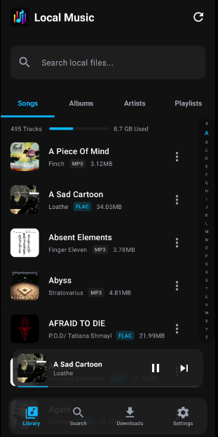
  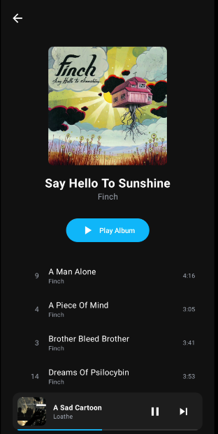
  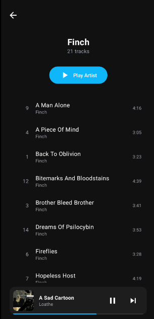
</p>

### 📂 Downloads Section
- Dedicated view for all downloaded content
- Quick access to recently downloaded tracks
- Share, delete, or view track details

<p align="center">
  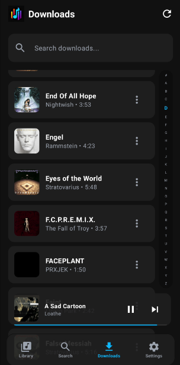
</p>

### 🎵 Music Player
- Full-featured music player with beautiful UI
- Album art display with blurred background
- Play/Pause, Next, Previous controls
- Shuffle and Repeat modes (Off, Repeat All, Repeat One)
- Progress bar with seek functionality
- Add tracks to favorites
- Add tracks to custom playlists
- **Synchronized Lyrics** - View lyrics that scroll with the music

<p align="center">
  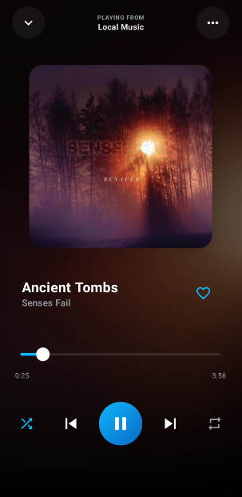
  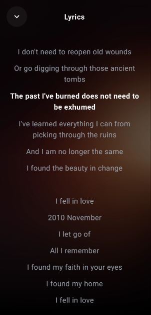
</p>

### 📝 Playlist Management
- Create custom playlists
- Add downloaded tracks to playlists
- Import playlists from Deezer

### ⚙️ Settings & Customization
- **Audio Quality**: Choose between MP3_128, MP3_320, or FLAC
- **Language**: English and Spanish support
- **Download Location**: Save to Music or Downloads folder

<p align="center">
  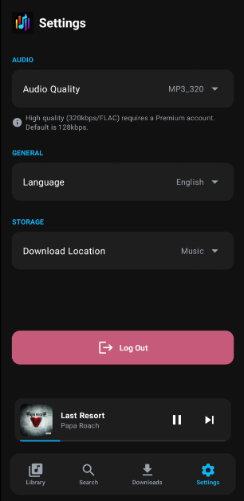
</p>

### 🔐 Authentication
- Secure login with Deezer ARL token
- Premium account support for high-quality downloads

---

## 🛠️ Technical Stack

| Component | Technology |
|-----------|------------|
| **Language** | Kotlin |
| **UI Framework** | Jetpack Compose with Material 3 |
| **Architecture** | MVVM with ViewModels |
| **Local Storage** | SharedPreferences, MediaStore |
| **Async Operations** | Kotlin Coroutines & Flow |
| **Media Playback** | Media3 (ExoPlayer) |
| **Image Loading** | Coil |
| **Native Bridge** | UniFFI (Rust bindings) |
| **Download Engine** | Rusteer (Custom Rust library) |

---

## 📋 Requirements

- Android 7.0 (API 24) or higher
- Valid Deezer ARL token
- Internet connection for downloading content
- Storage permission for saving music files

---

## 🚀 Installation

1. Download the latest APK from the releases section
2. Enable "Install from unknown sources" in your device settings
3. Install the APK
4. Launch the app and enter your Deezer ARL token to log in

---

## 🔧 Building from Source

```bash
# Clone the repository
git clone https://github.com/xScherpschutter/deeztracker-mobile.git

# Navigate to project directory
cd deeztracker-mobile

# Build debug APK
./gradlew assembleDebug

# Build release APK
./gradlew assembleRelease

# Install on connected device
./gradlew installRelease
```

---

## 📁 Project Structure

```
app/
├── src/main/java/com/crowstar/deeztrackermobile/
│   ├── features/
│   │   ├── deezer/         # Deezer API integration
│   │   ├── download/       # Download management
│   │   ├── localmusic/     # Local music database
│   │   ├── lyrics/         # Lyrics fetching & sync
│   │   ├── player/         # Media playback
│   │   └── rusteer/        # Rust FFI bindings
│   └── ui/
│       ├── components/     # Reusable UI components
│       ├── screens/        # App screens
│       ├── theme/          # Material Theme
│       └── utils/          # UI utilities
└── src/main/res/           # Resources (strings, drawables)
```

---

## 🌐 Localization

The app currently supports:
- 🇺🇸 English
- 🇪🇸 Spanish

---

## ⚠️ Disclaimer

This application is intended for personal use only. Please respect copyright laws and the terms of service of music platforms. The developers are not responsible for any misuse of this application.

---

## 📄 License

This project is licensed under the [MIT License](LICENSE).

---